# Youtube Automated Channel Monitoring using Nifi and Grafana

Solution for automatically monitor statistics of YouTube channels and the videos belonging to those channels. The ETL process is carried out in **Apache Nifi**, the storage is made in a **PostgreSQL** database and the visualisation is handled by **Grafana + ECharts**. All these services run and communicate with each other through their respective **Docker** containers.

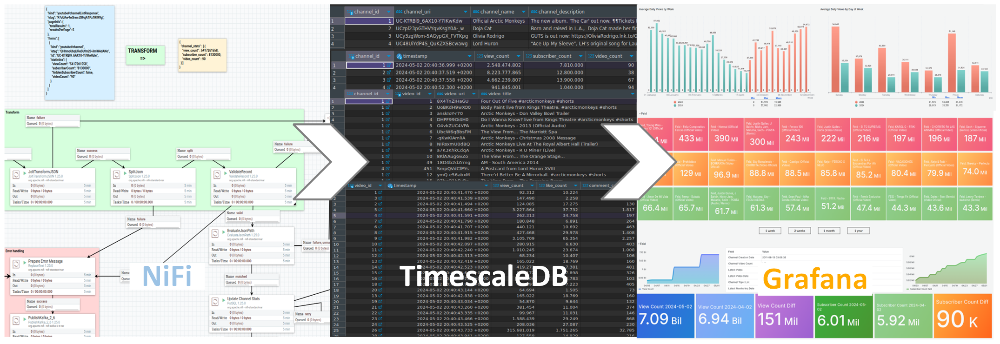

---

# Contents

1. [Requirements](#1-requirements)
2. [Installation](#2-installation)
3. [Documentation](#3-documentation)
4. [Troubleshooting](#4-troubleshooting)
5. [Clean restart / Uninstall](#5-clean-restart--uninstall)

# 1. Requirements

- Docker

- Python3 (install *requests* library)

# 2. Installation

Clone this repository

```bash
git clone https://github.com/docker/awesome-compose.git
```

## 2.1. Docker boot

Run script `utils/create_volumes.py` to create empty folders in which persistent data will be stored.

```bash
python3 create_volumes.py
```

Run docker compose file.

```bash
docker compose -f docker-compose.yml up -d
```

**Note**: To see the docker logs you can use the following command:

```bash
docker compose -f docker-compose.yml logs -f
```

These Docker containers will be active from now on, even if you restart the computer. To stop the execution of all containers:

```bash
docker compose -f docker-compose.yml down
```

## 2.2. Nifi configuration

1. Enter Nifi at `http://localhost:8080/nifi/` .

2. Right click on the canvas. *'Upload template'* option. Select file `data/utils/nifi_youtube-stats.xml`.

3. Drag *'Template'* from top navigation bar to the canvas. Select the template just uploaded.

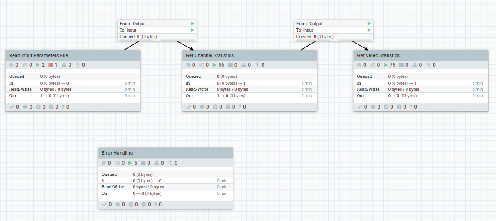

4. RIght click on the canvas. *'Variables'*. Set the following list of variables (*+* button to add each one):

| name                       | value                     |
| -------------------------- | ------------------------- |
| db_address                 | timescaledb-youtube-stats |
| db_port                    | 5432                      |
| error_messages_persistence | 30                        |
| postgresql_jdbc_url        | jdbc:postgresql://        |

5. Create file *input_channel_info.json* in `data/nifi/utils` depending on the channel(s) you want to monitor.

| option                    | description                                                                                                                                                                                                                                                                                                                                          |
| ------------------------- | ---------------------------------------------------------------------------------------------------------------------------------------------------------------------------------------------------------------------------------------------------------------------------------------------------------------------------------------------------- |
| **update_channel_info**   | *true/false*. Once the monitoring process for this channel has been run for the first time, update the channel information each time the data monitoring process is performed (information such as title, description, topics list, etc.). This information does not usually change from day to day, so we can save API quota if it is set to false. |
| **update_video_info**     | *true/false*. Once the monitoring process for this video has been run for the first time, update the video information each time the data monitoring process is performed (information such as video title, description, video category, etc.). We can save API quota if it is set to false.                                                         |
| **update_period_in_days** | *Integer*.  Time interval in days that has to pass before a channel and its videos are monitored again.                                                                                                                                                                                                                                              |
| **ts_from**               | *date / null*. Videos with a release date on or after this date will be monitored.                                                                                                                                                                                                                                                                   |
| **ts_to**                 | *date / null*. Videos with a release date on or before this date will be monitored.                                                                                                                                                                                                                                                                  |
| **duration_min**          | *Integer / null*. Videos with a duration in seconds equal to or greater than this number will be monitored.                                                                                                                                                                                                                                          |
| **duration_max**          | *Integer / null*. Videos with a duration in seconds equal to or less than this number will be monitored.                                                                                                                                                                                                                                             |
| **filter_key_list**       | *Array of strings / null*. Videos in which any of these key words match the title of the video will not be monitored.                                                                                                                                                                                                                                |
| **monitoring_list**       | *Array of objects*. Each api key is combined with a list of channels that we want to monitor using that api key to get the statistics from the Youtube API. Each channel is referred to by its ID (to obtain this ID, click on the arrow at the end of the channel description, click on *Share channel* and click on *Copy channel ID*).            |

An example configuration would be as follows:

```json
[{
   "update_channel_info":false,
   "update_video_info":false,
   "update_period_in_days": 1,
   "ts_from":"2015-01-01",
   "ts_to": "2024-03-28",
   "duration_min": 70,
   "duration_max": 540,
   "filter_key_list": ["#shorts", "amazon"],
   "monitoring_list":[
      {
         "api_key":"xxxxxxxxxxxxxxxxxxxxxxxxxxxxxxxxxxxxxxx",
         "channel_list":[
            "UC-KTRBl9_6AX10-Y7IKwKdw",
            "UCy3zgWom-5AGypGX_FVTKpg"
         ]
      },
      {
         "api_key":"yyyyyyyyyyyyyyyyyyyyyyyyyyyyyyyyyyyyyyy",
         "channel_list":[
            "UCzpl23pGTHVYqvKsgY0A-_w"
         ]
      }
   ]
},{
   "update_channel_info":false,
   "update_video_info":true,
   "update_period_in_days": 2,
   "ts_from": null,
   "ts_to": null,
   "duration_min": null,
   "duration_max": null,
   "filter_key_list": [],
   "monitoring_list":[
      {
         "api_key":"yyyyyyyyyyyyyyyyyyyyyyyyyyyyyyyyyyyyyyy",
         "channel_list":[
            "UC48UiYdP4S_QuKZXSBcwawg"
         ]
      }
   ]
}]
```

**FIrst element/configuration explanation:** daily monitoring is done in which the channel and video information is not updated in the process. The videos to be monitored will be those that were released between 1 January 2015 and 28 March 2024, are between 70 seconds and 540 seconds long, and their title does not contain any of the key words *'#shorts'* and *'amazon'*. The API key *xxxx....* is used in the YouTube API call for the first two channels and the API key *yyy...* is used in the API call for the first two channels. for the third channel.

**Second element/configuration explanation**: monitoring is done every two days in which the channel information is not updated but the video information is updated in the process. We use the API key *yyyy....* is used in the Youtube API call for the fourth and last channel.

6. Right click on the canvas. *'Configure'*. *'Controller Services'*. *+* button. Add a new *DistributedMapCacheServer* with default configuration (for any reason this service cannot be set by the template). Enable this service (*lightning* icon).

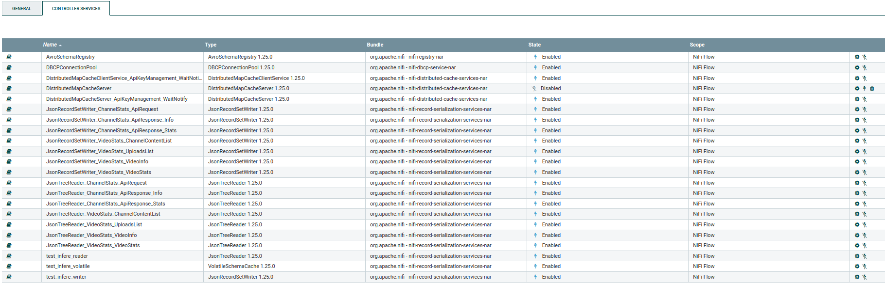

1. Still in *'Controller Services'*. Modify *DBCPConnectionPool*. *'Properties'*. *'Password'*. Set *nifi* as default password. *'Apply'*. Enable this service.

2. Enable the rest of services (*DistributedMapCacheClienteService_ApiKeyManagement_WaitNotify*, *AvroSchemaRegistry*, etc.). Before clicking, try to select *Scope*: *Service and referencing components* in order to enable in cascade all services dependent on it.

3. To boot up all processors: RIght click on the canvas. *'Start'*. Optional: if you want to start the process now instead of waiting for the scheduler to take over (by default, hourly), go to '*Read Input Parameters FIle*' process group, stop *'GenerateFlowFile'* processor, right click on the processor and select *'Run Once'* .

## 2.3. Grafana configuration

Run script `utils/import_datasources_and_dashboards.py` .

```bash
python3 import_datasources_and_dashboards.py
```

Go to `http://localhost:3000/`. Log in: **user**: *admin*, **password**: *admin123456789*. Go to *'Connections'*. *'Data sources'*. *'ys'*. **Password**: *grafana*.

# 3. Documentation

## 3.1. Nifi ETL process

Once the installation is finished, the Nifi background process will try every hour (at 0 minutes 0 seconds) to monitor the channels defined in the input JSON.

If we want to modify the scheduling of this process: **Read Input Parameters FIle** -> **GenerateFlowFile** -> **Scheduling** -> **Run Schedule**: Scheduled CRON, how often we want the monitoring process to be executed. The parameter *update_period_in_days* in input file has priority because, no matter how much this processor is initialised during the day, if a channel has already been monitored on the day or (*update_period_in_days* - 1) days before, it will be discarded and won't be monitorised until *update_period_in_days* have passed.

**Note**: If *update_period_in_days* is set to 0 it means that there is no restraint of days between monitoring and thus monitoring will be performed according to the *CRON* configured in the Nifi GenerateFlowFile.

The operations performed in each processing group are explained by the Nifi notes placed on the canvas and the name assigned to each processor itself, as can be seen in the following example image:

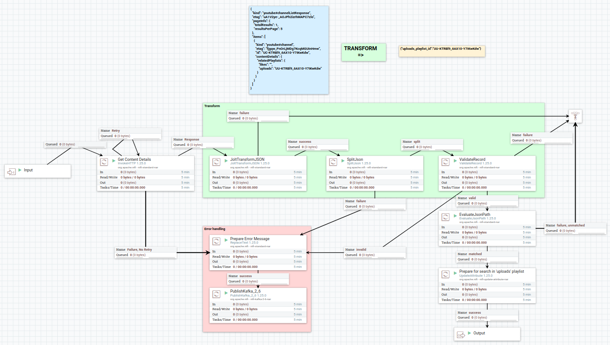

The workflow of each processing group is summarised as follows:

- **Read Input Parameters File**: Starts the monitoring process according to the schedule configured in the CRON. Loads the file *input_channel_info.json*.

- **Get Channel Statistics**: Get information and statistics of each channel.
  
  - **Prepare API Request**: Split 'input_channel_info.json' into one FlowFile per channel and api key.
  
  - **Check if channel already in DB / already updated**:
    
    - Discard FlowFiles that are not needed to get statistics as it has already been done earlier in that day or in the last days (depending on *update_period_in_days*).
    
    - Wait-notify mechanism to control concurrency: all FlowFiles are queued in the *'Wait'* processor, when we finish storing all the information for a channel and its videos, this processor is notified to let the next FlowFile pass and continue the process of obtaining information and statistics.
    
    - API Key Quota: the quota of this api key is checked in the `youtube_stats.api_key_quota` table (if the record exists), if this value is greater than 9200, the process is terminated here to avoid exceeding the quota.
    
    - Routes the output to get the information of this channel if the *update_channel_info* option is active, otherwise it is routed directly to get the channel statistics.
  
  - **Get Channel Info**: API Request to obtain Channel Information and store it in `youtube_stats.channel_info` table.
  
  - **Update Channel Stats**: API Request to obtain Channel Statistics and store it in `youtube_stats.channel_stats` table.

- **Get Video Statistics**: Get information and statistics of each video from a channel (that has passed the corresponding filters).
  
  - **Get Content Details**: Get playlist of videos uploaded to the channel, from which the ID of each video will be taken.
  
  - **Get Channel Content**: Loop through all the pages (each page contains 50 videos) to accumulate the complete list of videos on the channel.
  
  - **Split Channel Content & Filter**: Split the flowfile containing the list of videos into one flowfile per video. The video release date filter is also applied with the *ts_from* and *ts_to* parameters specified in *input_channel_info.json*.
  
  - **Check if video already in DB**: Routes the output to get the information of this video if the *update_video_info* option is active, otherwise it is routed directly to get the video statistics.
  
  - **Get Video Info**: API Request to obtain Video Information and store it in `youtube_stats.video_info` table.
  
  - **Update Video Stats**:
    
    - API Request to obtain Video Statistics and store it in `youtube_stats.video_stats` table.
    
    - Wait for the insertion of all videos from the same channel to merge and proceed to notify the *'Wait'* process that the process for this channel has finished and can continue with the next one in the queue.
    
    - An estimate is also made of the quota used for this channel based on the videos monitored and the `youtube_stats.api_key_quota` table is updated.

## 3.2. TimescaleDB design

`youtube_stats.channel_info`: Store channel information

| Field                   | Type         | Constraint/References | Example                                                                                                                  |
| ----------------------- | ------------ | --------------------- | ------------------------------------------------------------------------------------------------------------------------ |
| *channel_id*            | SERIAL       | PRIMARY KEY           | 4                                                                                                                        |
| *channel_uri*           | VARCHAR(50)  | UNIQUE NOT NULL       | UC48UiYdP4S_QuKZXSBcwawg                                                                                                 |
| *channel_name*          | VARCHAR(128) | UNIQUE NOT NULL       | Lord Huron                                                                                                               |
| *channel_description*   | TEXT         | NOT NULL              | “Ace Up My Sleeve”, LH’s original song for Laurel Parmet’s feature film ...                                              |
| *channel_custom_uri*    | VARCHAR(128) | NOT NULL              | @lordhuron                                                                                                               |
| *channel_creation_date* | TIMESTAMPTZ  | NOT NULL              | 2011-07-26 21:32:35.000 +0200                                                                                            |
| *channel_topic_list*    | JSONB        | NOT NULL              | [{"topic_id": "/m/06by7", "topic_category": "Rock_music"}, {"topic_id": "/m/064t9", "topic_category": "Pop_music"}, ...] |

`youtube_stats.channel_stats`: Store channel statistics

| Field              | Type        | Constraint/References                                                      | Example                       |
| ------------------ | ----------- | -------------------------------------------------------------------------- | ----------------------------- |
| *channel_id*       | INT         | PRIMARY KEY, FOREIGN KEY youtube_stats.channel_info (channel_id), NOT NULL | 4                             |
| *timestamp*        | TIMESTAMPTZ | PRIMARY KEY, NOT NULL                                                      | 2024-05-02 20:40:52.300 +0200 |
| *view_count*       | BIGINT      | NOT NULL                                                                   | 941845001                     |
| *subscriber_count* | INT         | NOT NULL                                                                   | 1040000                       |
| *video_count*      | SMALLINT    | NOT NULL                                                                   | 94                            |

`youtube_stats.video_info`: Store video information

| Field                 | Type         | Constraint/References                                         | Example                                                                    |
| --------------------- | ------------ | ------------------------------------------------------------- | -------------------------------------------------------------------------- |
| *channel_id*          | INT          | FOREIGN KEY youtube_stats.channel_info (channel_id), NOT NULL | 4                                                                          |
| *video_id*            | SERIAL       | PRIMARY KEY                                                   | 433                                                                        |
| *video_uri*           | VARCHAR(50)  | UNIQUE NOT NULL                                               | 5b0Pt-k1hGo                                                                |
| *video_title*         | VARCHAR(128) | UNIQUE NOT NULL                                               | Lord Huron - Not Dead Yet (Official Video)                                 |
| *video_description*   | TEXT         | NOT NULL                                                      | Stream/Download Long Lost, the new album from Lord Huron ...               |
| *video_creation_date* | TIMESTAMPTZ  | NOT NULL                                                      | 2021-02-19 06:00:04.000 +0100                                              |
| *video_duration*      | INT          | NOT NULL                                                      | 212                                                                        |
| *video_category*      | SMALLINT     | NOT NULL                                                      | 10                                                                         |
| *video_tags*          | JSONB        | NOT NULL                                                      | ["Lord Huron", "Lord Huron Not Dead Yet", "Not Dead Yet", "Not Dead", ...] |

`youtube_stats.video_stats`: Store video statistics

| Field            | Type        | Constraint/References                                                  | Example                       |
| ---------------- | ----------- | ---------------------------------------------------------------------- | ----------------------------- |
| *video_id*       | INT         | PRIMARY KEY, FOREIGN KEY youtube_stats.video_info (video_id), NOT NULL | 433                           |
| *timestamp*      | TIMESTAMPTZ | PRIMARY KEY, NOT NULL                                                  | 2024-05-02 20:41:24.638 +0200 |
| *view_count*     | BIGINT      | NOT NULL                                                               | 1818872                       |
| *like_count*     | INT         | NOT NULL                                                               | 25196                         |
| *favorite_count* | INT         | NOT NULL                                                               | 0                             |
| *comment_count*  | INT         | NOT NULL                                                               | 1260                          |

`youtube_stats.error_messages`: Helps to debug errors occurring in the ETL process. We leave enough information in the metadata field to be able to reproduce the error later on.

| Field                    | Type         | Constraint/References | Example                                                                                                                                                                          |
| ------------------------ | ------------ | --------------------- | -------------------------------------------------------------------------------------------------------------------------------------------------------------------------------- |
| *error_id*               | SERIAL       | PRIMARY KEY           | 3719                                                                                                                                                                             |
| *error_timestamp*        | TIMESTAMPTZ  | NOT NULL              | 2024-04-18 11:11:13.582 +0200                                                                                                                                                    |
| *error_process_group*    | VARCHAR(128) | NOT NULL              | Merge, Update Quota & Notify                                                                                                                                                     |
| *error_processor*        | VARCHAR(128) | NOT NULL              | MergeContent                                                                                                                                                                     |
| *error_flowfile_content* | TEXT         | NOT NULL              | {}                                                                                                                                                                               |
| *error_metadata*         | JSONB        | NOT NULL              | {"api_key": "xxxxxxx....", "channel_uri": "UC48UiYdP4S_QuKZXSBcwawg", "merge.count": "432", "likely_cause": "Problems inserting one or several videos", "fragment.count": "620"} |

`youtube_stats.api_key_quota`: API Key Quota tracking. It is reset daily and the maximum is 10,000 tokens.

| Field                  | Type        | Constraint/References | Example                       |
| ---------------------- | ----------- | --------------------- | ----------------------------- |
| *api_key_id*           | SERIAL      | PRIMARY KEY           | 1                             |
| *api_key_restart_date* | TIMESTAMPTZ | NOT NULL              | 2024-05-02 10:04:30.387 +0200 |
| *api_key*              | VARCHAR(40) | UNIQUE NOT NULL       | xxxxxxxx...                   |
| *api_key_quota*        | INT         | NOT NULL              | 7188                          |

## 3.3. Grafana dashboards

### Youtube Channel

Basic information on each of the selected channels

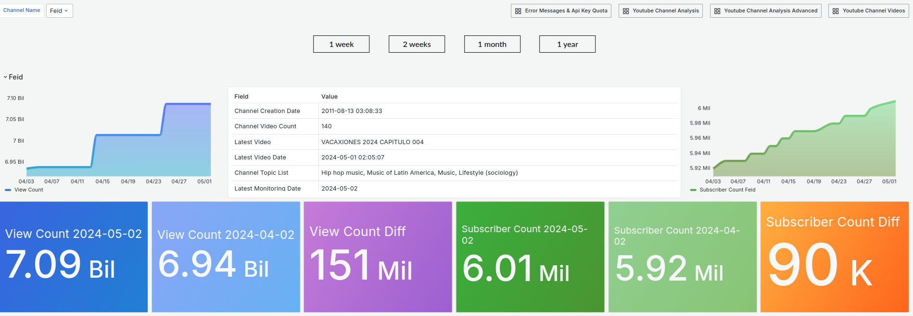

### Youtube Channel Analysis

Overview of the videos belonging to the channel.

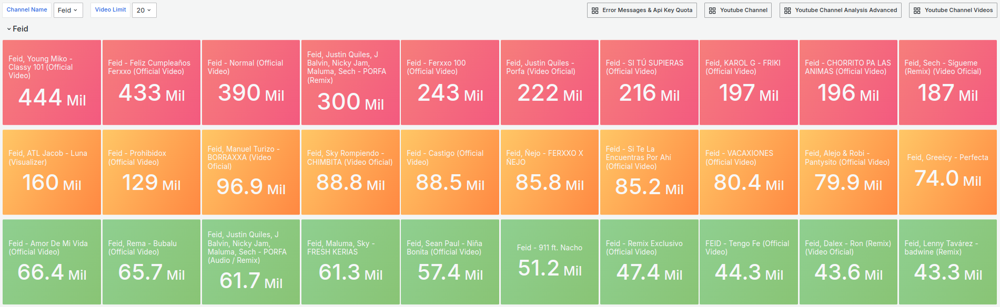

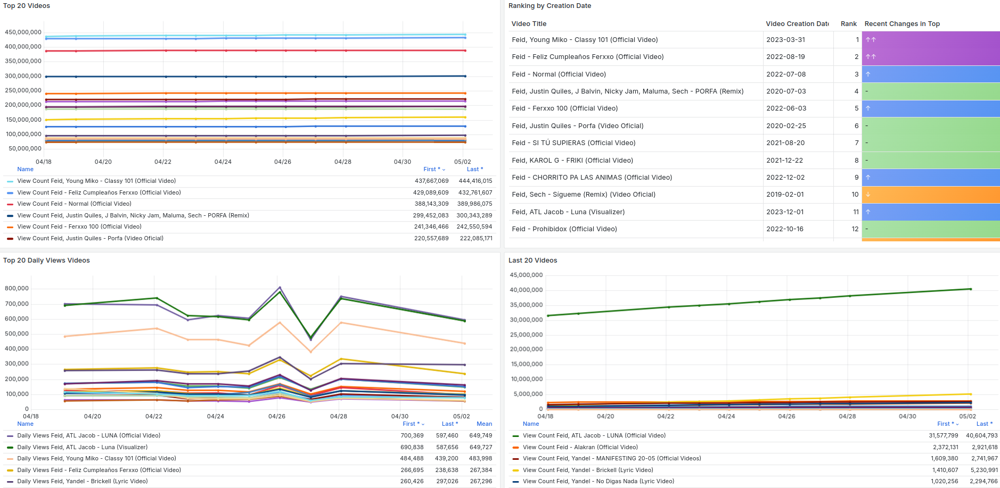

### Youtube Channel Analysis Advanced

More detailed view of the videos belonging to the channel.

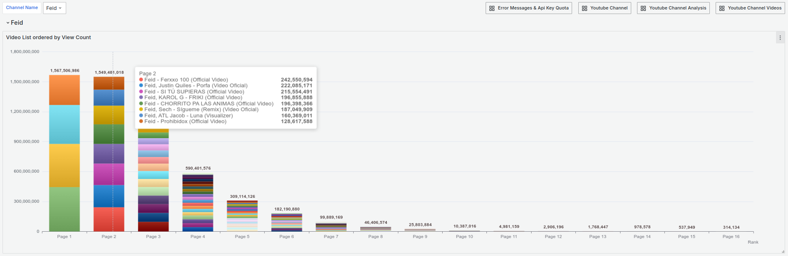

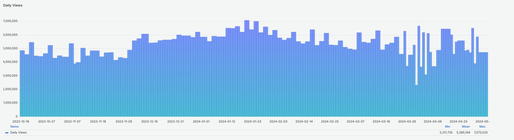

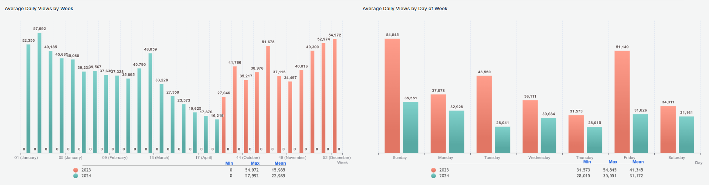

### Youtube Channel Videos

Compare the statistics of selected videos from two different channels with each other.

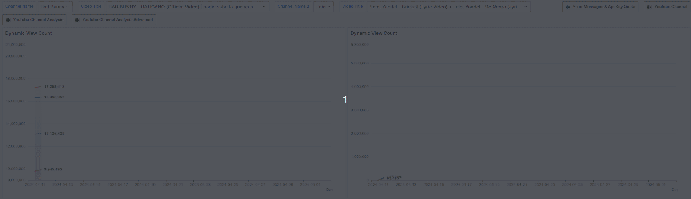

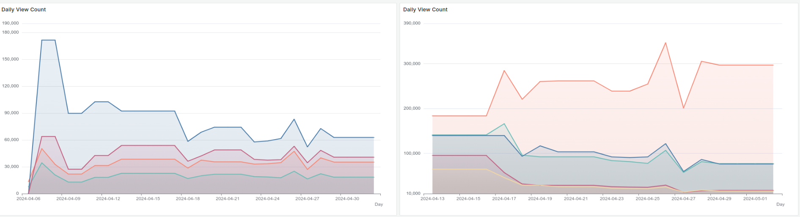


### Error Messages & Api Key Quota

Overview of error messages produced in the Nifi ETL process and API Key status and quota.

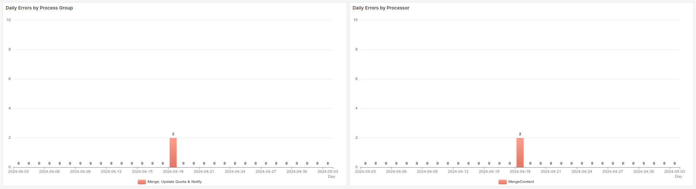

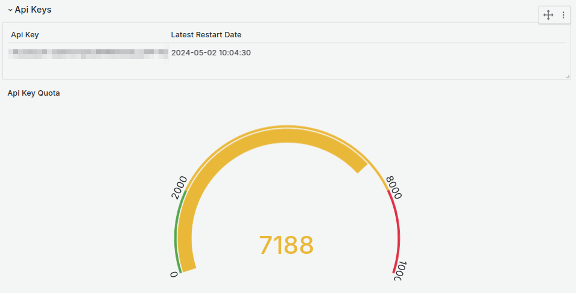

# 4. Troubleshooting

## 4.1. Ports

The following ports will be used:

- **Nifi**: *8080*

- **Timescaledb**: *5432*

- **Kafka**: *9092*

- **Grafana**: *3000*

If any of these ports are already occupied, appropriate modifications in *docker-compose.yml* must be made to allow the container to use another port that is not in use.

### Nifi

- Modify *docker-compose.yml*:
  - Modify the *8080* on the left in `nifi.port` since it refers to the host port, do not modify the 8080 on the right since it refers to the container internal port.
  - Modify the *8080* in `nifi.environment.NIFI_WEB_PROXY_HOST`.
- The Nifi URL will change to `http://localhost:(new_port)/nifi/`

### Timescaledb

- Modify *docker-compose.yml*: *5432* on the left in `timescaledb.port`.
- The Database URL will change to `jdbc:postgresql://localhost:(new_port)/dev`
- Edit Nifi variable *db_port* with new port established.

### Kafka

- Modify *docker-compose.yml*: *9092* on the left in `kafka.port`.

### Grafana

- Modify *docker-compose.yml*: *3000* on the left in `grafana.port`.

- The Grafana URL will change to `http://localhost:(new_port)/grafana`

- Edit `utils/import_datasources_and_dashboards.py` , host variable with new port established.

## 4.2. Data Ingestion

Any problems in the Nifi data ingestion will be logged in the `youtube_stats.error_messages` table (and therefore in *Error Messages & Api Key Quota* Grafana Dashboard), with the content of the FlowFile and the relevant attributes to debug why the problem has occurred, although the most common errors I have seen in recent tests are usually because the API Key has exceeded the quota limit and no more API requests can be made.

This information is automatically cleared past `error_messages_persistence` days.

# 5. Clean restart / Uninstall

Type the following Docker commands:

```bash
docker compose -f docker-compose.yml down -v --remove-orphans
```

## 5.1. Clear restart

Before continuing, think about saving files that you might need in the future such as the input JSON *input_channel_info.json*.

Then delete the persisted container data stored in each volume on the following folders:

```bash
data/
├─ grafana/
├─ kafka/
│  ├─ data/
│  ├─ secrets/
├─ nifi/
│  ├─ conf/
│  ├─ database_repository/
│  ├─ flowfile_repository/
│  ├─ logs/
│  ├─ provenance_repository/
│  ├─ state/
│  ├─ utils/
├─ timescaledb/
├─ zookeeper/
│  ├─ data/
│  ├─ datalog/
```

**Note**: Do not delete folders, only their contents.

The script in `utils/clear_volumes.py` can be used for this purpose. You will probably need root permissions to run it and not have permissions problems.

```bash
sudo python3 clear_volumes.py
```

## 5.2. Uninstall

if the images used to create the containers for this project are not being used or are not planned to be used, you can also proceed to delete them with the following command:

```bash
docker compose -f docker-compose.yml down --rmi all
```

Then delete the entire project folder.
